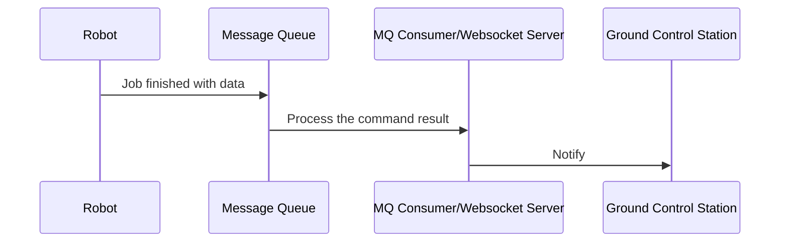

# Design Principles

## Get started
There's a `Makefile` for the commonly used commands.
```sh
# Run all tests
make test

# Run the server 
make run
# or to override the port
PORT=8888 make run

# Build a binary file
make build

# Build a docker image
make docker-build
``` 

## Code Structure
a-restful
- `cmd`: The entry points to start an application
- `internal`:  All the core logic should be here
    - `mock`: Mock struct for test
    - `service`: All the business logic should be here, should be the most complicated file in the project
    - `transport`: Handle the API specific implementation which is the REST handler. Other possible transport layers can be gRPC and GraphQL.
    - `util`: Any helper struct goes into here
- `thirdparty`: This directory should not exist, everything here should be from the robot SDK. I made up this for the purpose of take home test. 

## Libraries
Though there are more performant framework in the community, I personally like to go for the standard library first as they are robust and easy to understand. Most of the web framework like Gin, Echo and Chi are compatible with the standard library, it's easy to switch if we have any performance issue later.
Minimizing the dependency can also speed up the build time for CI/CD, which is essential for a good developer experience.     

## Testability
To achieve a good test coverage, most of the structs in the project support dependency injection(DI). For example, when we test the error case of the cancel task endpoint, we can create a mock robot returns an error during from the SDK. Technically we can achieve 100% coverage.
This also enables developers to test the REST logic even when the SDK is still unavailable.

## Extendability
I assume the REST server will be running in the robot to accept requests from the ground control station. JSON payload in HTTP calls is quite large in size, probably we may want to further improve the performance by using gRPC. The reusable `service` will be the key for extending/migrating the feature. We can create a `grpc` package in the `tranport` directory and as all the core logic is available in the `service` struct, the migration will be quick and easy. 
   
## Challenge
```
The Robot SDK is still under development, you need to find a way to prove your API logic is working.
```
We can refer to [Testability](#testability), we can create a mock robot and inject it into the service struct to test all the possible path of the API logic.

```
The ground control station wants to be notified as soon as the command sequence completed. Please provide a high level design overview how you can achieve it. This overview is not expected to be hugely detailed but should clearly articulate the fundamental concept in your design.
```
There are two possible solutions:
1. The simplest infrastructure
We can run another REST API in the ground control station. As soon as the robot completed the command sequence, they can initiate an API call to the ground control station' endpoint for the notification.
Pros:
- Easy to implement
Cons:
- Either the robot or the ground control server have to handle the retries if the call failed.    

2. Simpler infrastructure, but thinner on client side and more real time 
Instead of running an REST API in solution 1, we can run an additional Websocket server in the robot. The ground control station now only needs to run a websocket client connecting the robot. As soon as the robot completed a command, it now just need to send a websocket message to the ground control station.
Pros:
- Reduce the network overhead from the REST call
Cons: 
- More works running on the robot may reduce its battery life.   


3. More infrastructure but much more reliable (Preferred) 
A more sophisticated solution can be done with a message queue. We then run a separate application outside the robot and the ground control station. The application serves as a bridge between the robot and the ground control station. It will pick up the message from the MQ, process it and then notify the ground control station client by websocket. 
The data flow works as below



Pros:
- Less works running on the robot can release its resources to do some other work
- A message queue(e.g. RabbitMQ or AWS SQS) make it easy to handle all edge cases like retry on failure and rate limit.
- A dedicated server to run the bridge application should be more powerful and stable.
- Easy to set up other monitoring tools

Cons:
- More expensive and higher maintenance cost. 
